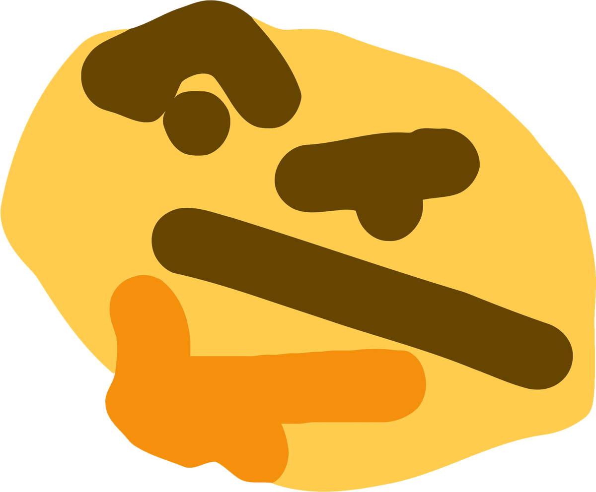

<p align="center"></p>
<h1 align="center">Thonk</h1>
<h3 align="center">A Discord bot written in Elixir</h3>

[](https://discord.io/unleashed/)
[](http://erlang.org/doc/)
[](https://elixir-lang.org/)
[](https://github.com/cronokirby/alchemy)

```elixir
# config/config.exs

use Mix.Config

config :porcelain, driver: Porcelain.Driver.Basic
config :thonk,
  token: "your token",
  prefix: "command prefix"

# Necessary to voice functionality
config :alchemy,
  ffmpeg_path: "/path/to/ffmpeg",
  youtube_dl_path: "/path/to/youtube-dl"
```

`mix deps.get && mix run --no-halt` <br>
or run it in interactive mode <br>
`mix deps.get && iex -S mix`
